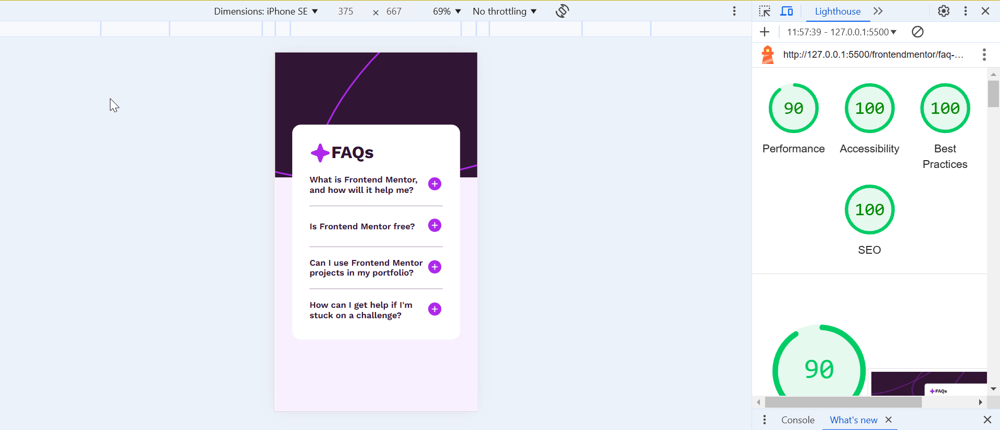

# Frontend Mentor - FAQ accordion solution

This is a solution to the [FAQ accordion challenge on Frontend Mentor](https://www.frontendmentor.io/challenges/faq-accordion-wyfFdeBwBz). Frontend Mentor challenges help you improve your coding skills by building realistic projects.

## Table of contents

- [Overview](#overview)
  - [The challenge](#the-challenge)
  - [Screenshot](#screenshot)
  - [Links](#links)
- [My process](#my-process)
  - [Built with](#built-with)
  - [What I learned](#what-i-learned)
  - [Continued development](#continued-development)
  - [Useful resources](#useful-resources)
- [Author](#author)
- [Acknowledgments](#acknowledgments)

## Overview

### The challenge

Users should be able to:

- Hide/Show the answer to a question when the question is clicked
- Navigate the questions and hide/show answers using keyboard navigation alone
- View the optimal layout for the interface depending on their device's screen size
- See hover and focus states for all interactive elements on the page

### Screenshot



### Links

- Solution URL: [Add solution URL here](https://your-solution-url.com)
- Live Site URL: [Add live site URL here](https://your-live-site-url.com)

## My process

### Built with

- Semantic HTML5 markup
- CSS custom properties
- Flexbox
- Vanilla Javascript

### What I learned

I learned that using `<button>` for interactive componenets is easy to navigate using keyboard:

```html
<button class="question">
  <p>Is Frontend Mentor free?</p>
  <div>
    
    
  </div>
</button>
```

I learned that `<section>` should have either a `title` or `aria-label` or `aria-labelledby` attribute.

I learned how to add some transition annimation in accordian to make it look smooth:

```css
.answer {
    color: var(--grayish-purple);
    padding-top: 0;
    max-height: 0;
    overflow: hidden;
    transition: max-height 0.3s ease, padding-top 0.3s ease;
}

.active {
    max-height: max-content;
    padding-top: 0.5em;
}
```

I learned about `nextElementSibling` and `previousElementSibling` in js to access required element:

```js
const answer = question.nextElementSibling;
const previousPlus = previousActive.previousElementSibling.querySelector('.plus');
```

### Continued development

I still need to practice the positioning an element & `@media`. I need to practice using JS for making the UI to react to different events. I also need to learn about responsive CSS, HTML5 rules & JS best practices. I need to learn more about `aria-*` tags for accessibilty.

### Useful resources

- [Accordion W3School](https://www.w3schools.com/howto/tryit.asp?filename=tryhow_js_accordion_animate) - This helped me in creating an accordian without using `display`.
- [Defer non-critical CSS](https://web.dev/articles/defer-non-critical-css) - I learned how to defer non-critical CSS to optimize the Critical Rendering Path.
- [HTML5 Landmark Elements](https://www.w3.org/WAI/ARIA/apg/patterns/landmarks/examples/HTML5.html) - I learned about HTML5 Landmark Elements.
- [Use semantic HTML for easy keyboard wins](https://web.dev/articles/use-semantic-html) - I learned about built-in interactive elements with proper semantics and keyboard support.

## Author

- Frontend Mentor - [@snigdha-sukun](https://www.frontendmentor.io/profile/snigdha-sukun)
